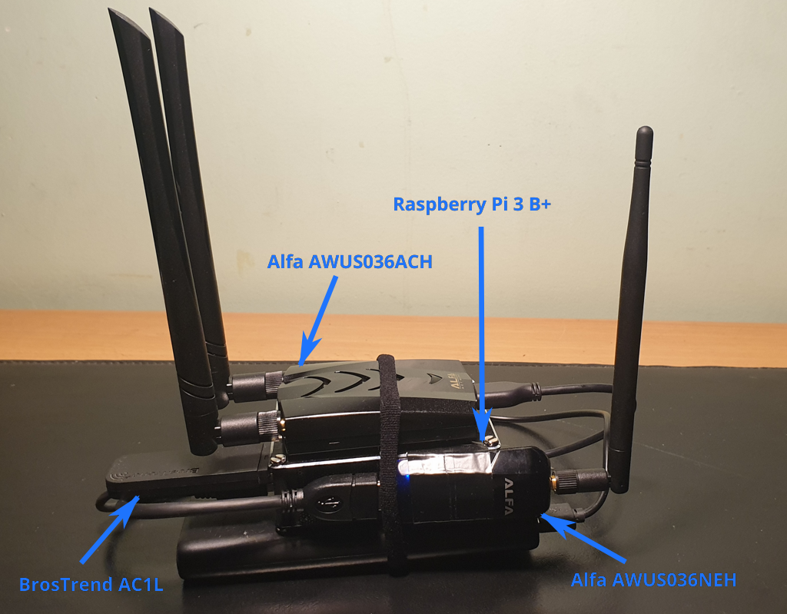

Pi-PwnBox:rocket:-RogueAP:satellite:
===============================================================================

**Homemade (headless) PwnBox / RogueAP based on Raspberry Pi & Alfa WiFi USB Adapters.**

[**WiFi Hacking Cheatsheets & Mind Map :bulb:**](#wifi-hacking-cheatsheets--mind-map)

Designed to be used for:

- On-site Red Team engagements,
- WiFi Security assessment, 
- WiFi Attacks practice.





Table of Contents
=================

* [Pi-PwnBox-RogueAP](#pi-pwnbox-rogueap)
* [Equipment used](#equipment-used)
* [WiFi USB Adapters Overview](#wifi-usb-adapters-overview)
* [Installation](#installation)
* [PwnBox Network Configuration](#pwnbox-network-configuration)
  * [Wireless Dedicated Administration Network](#wireless-dedicated-administration-network)
  * [LAN Network (Wireless or Wired)](#lan-network-wireless-or-wired)
* [PwnBox Remote Access](#pwnbox-remote-access)
* [Usage](#usage)
* [WiFi Hacking Cheatsheets &amp; Mind Map](#wifi-hacking-cheatsheets--mind-map)
* [Possible Upgrade](#possible-upgrade)

  

Equipment used
--------------

- [Raspberry Pi 3 Model B+](https://www.raspberrypi.org/products/raspberry-pi-3-model-b-plus)
- Micro SD Memory Card 64 Go
- Raspberry Pi Case
- Alfa WiFi USB Adapter [AWUS036NEH](https://www.alfa.com.tw/products_detail/10.htm)
- Alfa WiFi USB Adapter [AWUS036ACH](https://www.alfa.com.tw/products_detail/1.htm)
- BrosTrend WiFi USB Adapter AC1L AC1200 (can be replaced by any adapter supporting AP mode)
- USB cable Male to Female
- Rii Mini Wireless Keyboard (optional)
- Powerbank


WiFi USB Adapters Overview
--------------------------

| Device | Chipset  | Usage | 802.11 | 2.4 Ghz | 5 Ghz | Kali  out-of-box | Mon. Mode | Injec-tion | AP |
|----------|--------|--------|--------|------|-------------------------|--------------|-----------|---------|--------|
| **Built-in Raspberry Pi 3 B+ WiFi chip** | Broadcom 43430 | **Connection to Internet** (auto-start at boot if WiFi key added in config) | 802.11 b/g/n/ac | Y | Y | Y | N* | N* | Y |
| **BrosTrend AC1L AC1200** | Realtek RTL8812AU | **Acces Point for Remote Access** (auto-start at boot) | 802.11 a/b/g/n/ac | Y | Y | N | Y | N | Y |
| **Alfa AWUS036NEH** | Ralink RT2870/3070 | **WiFi Attacks** | 802.11 b/g/n | Y | N | Y | Y | Y | Y |
| **Alfa AWUS036ACH** | Realtek RTL8812AU | **WiFi Attacks** | 802.11 a/b/g/n/ac | Y | Y | Y | Y | Y | Y |

\* would require [nexmon](https://github.com/seemoo-lab/nexmon) patch to enable monitor mode and injection support on built-in Broadcom chip (but we do not need it for its usage here).


Installation
------------

1. Download Kali Linux ARM Image for Raspberry Pi: https://www.offensive-security.com/kali-linux-arm-images/
2. Flash Kali Linux ARM Image for Rapberry Pi onto Micro SD Card.
3. Make sure to have Internet connection on PwnBox.
4. Download install scripts/configurations on the PwnBox:
   ```
   git clone https://github.com/koutto/pi-pwnbox-rogueap.git
   ```
5. **Important:** Edit install script configuration at the top of `scripts/install-system.sh`file:

   - Choose *Guacamole* passwords.
   - Set WiFi interfaces persistent names based on their MAC addresses: `wlxaabbccddeeff` for a device with MAC address `aa:bb:cc:dd:ee:ff`.
   - Set MAC addresses of `eth0` & `wlan0` (built-in interfaces).
   - Set WiFi connection settings.
6. Run install script (will pause at the end of each step in order to allow for manual inspection of command outputs)
   ```
   cd pi-pwnbox-rogueap/scripts
   ./install-system.sh
   ```
7. Reboot & check correct configuration of network interfaces:

   ```
   ip a
   iwconfig
   ```
   - Built-in wired and wireless interfaces should be named `eth0` and `wlan0` respectively.
   - WiFi USB Adapters should use persistent naming (modern naming convention).
   - AP (`PWNBOX_ADMIN`) should be started on appropriate `wlx*`interface.
8. Configure VNC-over-HTTP on *Guacamole*:
   1. Connect to Guacamole at http://<ip_pwnbox>:8080/guacamole/
   2. Go to *guacadmin (top right) > Settings > Connections*
   3. Click on *New Connection*
   4. Fill connection settings as follows:
      - Name = `pwnbox-vnc`
      - Location = `ROOT`
      - Protocol = `VNC`
      - Maximum number of connections = `3`
      - Maximum number of connections = `3`
      - Guacamole Proxy Hostname = `127.0.0.1`
      - Guacamole Proxy Port = `4822`
      - Network Hostname = `127.0.0.1`
      - Network Port = `5901`
      - Authentication Password = `(password chosen at install when running install-system.sh)`
      - Color depth = `True color (32-bit)`
9. Change default credentials:
   - Kali system credentials
   - Guacamole credentials (via `http://<ip_pwnbox>:8080/guacamole/#/manage/mysql/users/guacadmin`)


## PwnBox Network Configuration

### Wireless Dedicated Administration Network

 When booting, PwnBox automatically spawns an AP on one interface to allow for easy remote access:
- SSID = `PWNBOX_ADMIN` (Hidden SSID)
- WPA2  Passphrase (PSK) = `Koutto!PwnB0x!`
- IP AP = 10.0.0.1 (when connected to this network, PwnBox can be accessed at this IP)
- Network range = 10.0.0.1/24

### LAN Network (Wireless or Wired)

When booting, PwnBox automatically connects to:
- Wired network if Ethernet port is connected.
- WiFi network (using built-in Raspberry Pi chip) if there is available wireless network with saved connection settings (in `/etc/wpa_supplicant`). If you want to connect to a new WiFi network (not saved into PwnBox), it is necessary to add WPA passphrase of the network before:

  1. Access the PwnBox using another way, e.g.:

     - Use wireless dedicated administration network (most convenient approach),
     - Use wired network,
     - Use monitor + (wireless) keyboard.
  2. Add WPA passphrase to PwnBox local configuration:
     ```
     wpa_passphrase <SSID> <passphrase> >> /etc/wpa_supplicant.conf
     ```
  3. Test connection:
     ```
     wpa_supplicant -B -i wlan0 -c /etc/wpa_supplicant.conf
     dhclient -v wlan0
     ping 8.8.8.8
     ```
     

## PwnBox Remote Access

PwnBox can be controlled through:

- **SSH Service (22/tcp):**

  ```
  ssh kali@<ip_pwnbox>
  ```

- **VNC-over-HTTP with Guacamole (8080/tcp):** 

  ```
  http://<ip_pwnbox>:8080/guacamole
  ```

**PwnBox's IP** depends on the network you want to access it from:

- Via Wireless Dedicated Administration Network (i.e. connected to hidden SSID `PWNBOX_ADMIN`): IP is always `10.0.0.1`.
- Via LAN Network (wireless or wired): IP depends on the value allocated by DHCP server. IP can be found using `netdiscover`for example.

*Note: Guacamole service might take a lot of resources (RAM) when running. If not used, it can be stopped using `stop-guacamole.sh` script.*


## Usage

- Most of the time, only SSH access is necessary. (CLI tools).
- Additional tools are installed into */usr/share*.
- Tools with GUI or requiring spawning of multiple *xterm* (e.g. *airgeddon*) can be run through *Guacamole*.
- Tools with Web UI (e.g. *Kismet*, *Bettercap*) can be started and accessed remotely.

  

WiFi Hacking Cheatsheets & Mind Map
-----------------------------------------------

- [WiFi Hacking MindMap](mindmap/WiFi-Hacking-MindMap-v1.png) [[PDF version](mindmap/WiFi-Hacking-MindMap-v1.pdf)]

[](mindmap/WiFi-Hacking-MindMap-v1.png)


- [WiFi Hacking Theory Cheatsheets](https://github.com/koutto/pi-pwnbox-rogueap/wiki)
- [WiFi Hacking Commands Cheatsheets](https://github.com/koutto/pi-pwnbox-rogueap/wiki)
- [MitM Commands Cheatsheets](https://github.com/koutto/pi-pwnbox-rogueap/wiki/MitM-Commands)


Possible Upgrade
----------------

- Add 4G USB dongle for remote access to PwnBox using 4G cell network.
